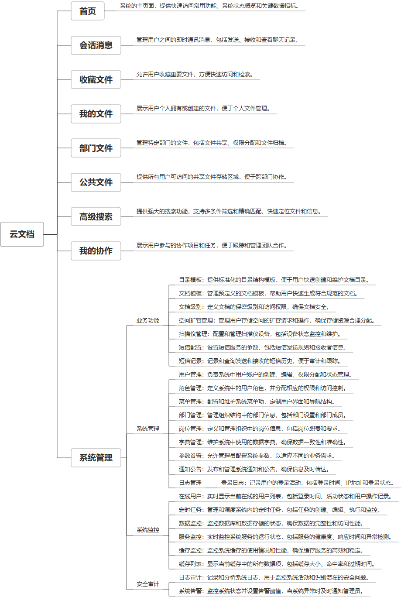

 

    
 

公司拥有上百套具有自主知识产权的软件系统，详情请查看码云首页或公司官网

 
<h1>云文档</h1>

<a href="https://www.haishi.net.cn/">公司官网</a> ｜ <a href="https://www.haishi.net.cn/">在线体验</a>

 

## 系统介绍

内部文档管理、分享、协同管理、编辑、内部IM等功能，用于对文档、知识库安全性要求较高的单位
内部文档管理、分享、协同管理、编辑、内部IM等功能，用于对文档、知识库安全性要求较高的单位
本项目名称为云文档系统，是一款面向企业的文档管理系统，旨在帮助企业实现文档的集中存储、共享、协作和管理。本系统从用户层面可以分为管理端和其他端:
- 管理端：公司内部管理员用户使用，可以进行系统配置、用户管理、权限管理、文档模板管理、空间管理等。
- 其他端：公司其他人员使用，可以进行文档上传、下载、预览、编辑、分享、协作等。
                

## 系统功能介绍

### 系统包含终端说明

管理端（WEB）

| 序号 | 模块 | 模块说明 |
| --- | --- | --- |
| 1 | QHY-YWD-JYW-SERVER | 服务端 |
| 2 | QHY-YWD-JYW-MANAGE | 管理端 |

### 系统功能结构

### 系统功能说明

本项目包含以下重要功能：
- 文档管理：提供文档上传、下载、预览、编辑、版本控制等功能，方便用户进行文档的存储和管理。
- 协作功能：支持多人同时编辑同一份文档，并提供实时聊天、评论等功能，提高团队协作效率。
- 权限管理：可以设置不同用户对文档的不同访问权限，保障文档安全。
- 全文搜索：支持对文档内容进行全文搜索，快速找到所需信息。
-  系统管理：提供系统配置、用户管理、角色管理、部门管理等功能，方便管理员对系统进行管理和维护。

## 系统主要界面

## 系统技术说明

### 代码模块说明

| 序号 | 目录 | 目录说明 |
| --- | --- | --- |
| 1 | QHY-YWD-JYW-SERVER/px-jjt-system | -- |
| 2 | QHY-YWD-JYW-SERVER/px-jjt-common | -- |
| 3 | QHY-YWD-JYW-SERVER/px-jjt-biz | -- |
| 4 | QHY-YWD-JYW-SERVER/px-jjt-quartz | -- |
| 5 | QHY-YWD-JYW-SERVER/px-jjt-framework | -- |
| 6 | QHY-YWD-JYW-SERVER/.github | -- |
| 7 | QHY-YWD-JYW-SERVER/px-jjt-admin | -- |
| 8 | QHY-YWD-JYW-SERVER/px-jjt-generator | -- |
| 9 | QHY-YWD-JYW-SERVER/.idea | -- |

### 系统技术选型

#### 开发语言/框架

JAVA（JDK1.8）
前端框架：VUE2
其他

#### 服务中间件

Nginx
Tomcat
ES

#### 数据库

MySQL（5.7+）

#### 其他说明

无

## 系统演示/商用

请扫码添加客服微信获取演示地址和系统详细资料。

如果您想基于云文档进行商业化交付或定制开发服务，我们提供有偿的技术服务支持，合作模式不限，欢迎沟通！

公司官网地址： <a href="https://www.haishi.net.cn/">https://www.haishi.net.cn</a>

联系客服获取专业回答。

## 使用须知

1、 本项目商用必须获得版权所有者的授权。

2、 未经允许本项目代码不允许二次出售。

